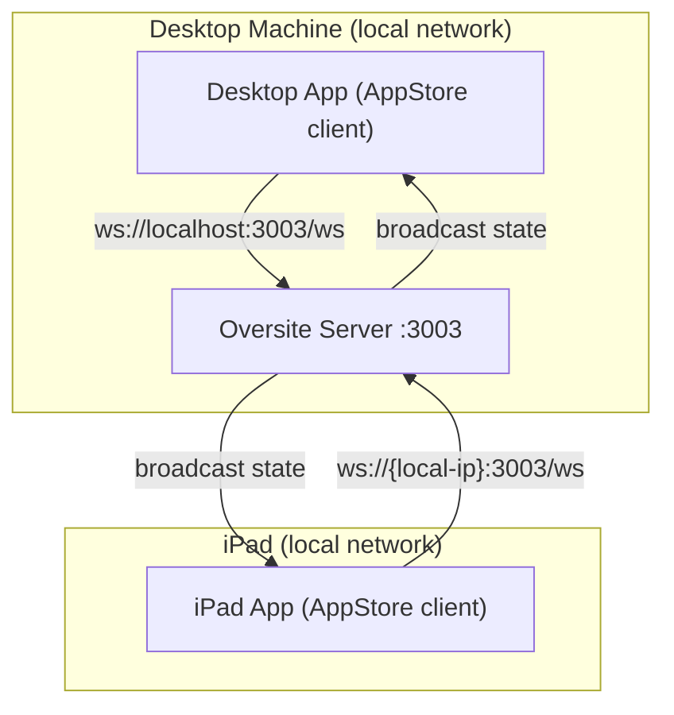
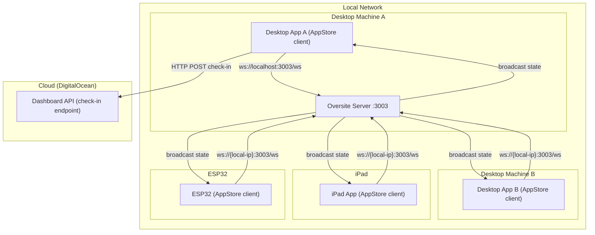

# System Diagrams

Architecture diagrams for common Oversite deployment patterns.

---

## Simple Show Controller (Local LAN)

A desktop app runs as the primary show controller. The Oversite server runs on the same machine. An iPad on the local network is a second AppStore client — both devices stay in sync via WebSocket broadcast.

**What this enables:** The iPad can act as a show control panel — setting AppStore keys that the desktop app reacts to, and vice versa. Either device can drive state changes; all clients see every update.

---

## Complex Multi-Machine Installation

All of the above, plus: the primary desktop app posts check-ins to a cloud-hosted Dashboard API, an ESP32 microcontroller streams sensor values into the AppStore over the local network, and a second desktop on a different machine is also an AppStore client — both desktops stay in sync through the shared server.

**What this enables:**
- Desktop A and Desktop B share all AppStore state in real time — a value set on one is immediately reflected on the other
- The iPad provides a show control UI accessible without touching either desktop
- The ESP32 streams sensor/accelerometer data into the AppStore as named keys; all clients can read those values
- The cloud Dashboard provides remote visibility (last-seen, uptime, screenshots) for the whole installation
